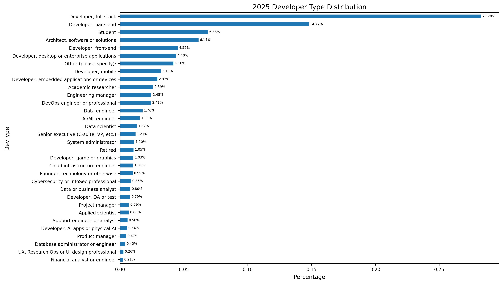
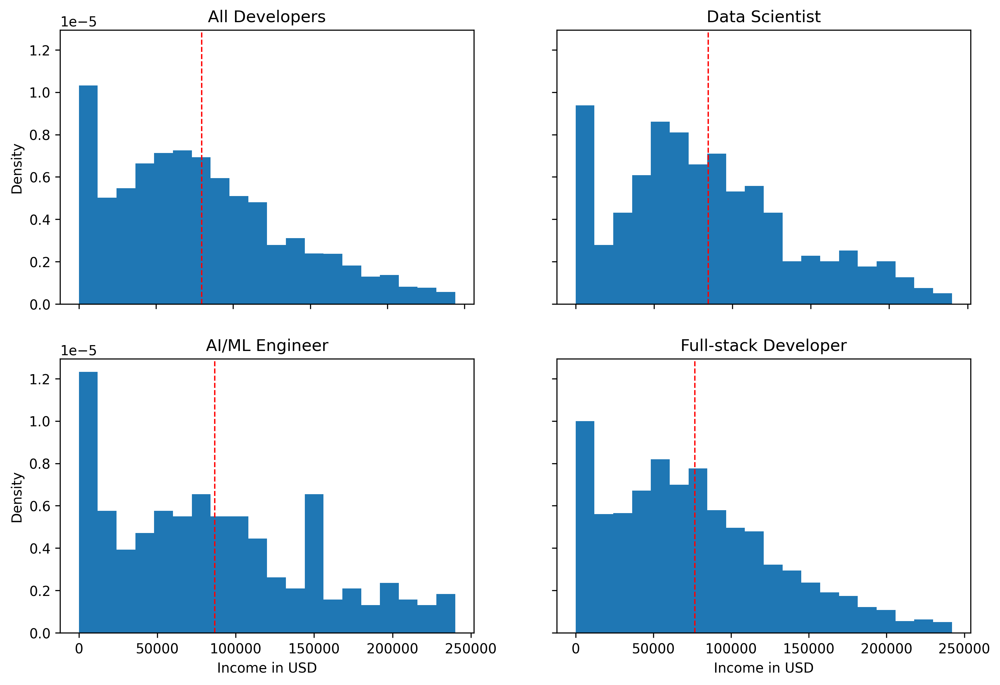
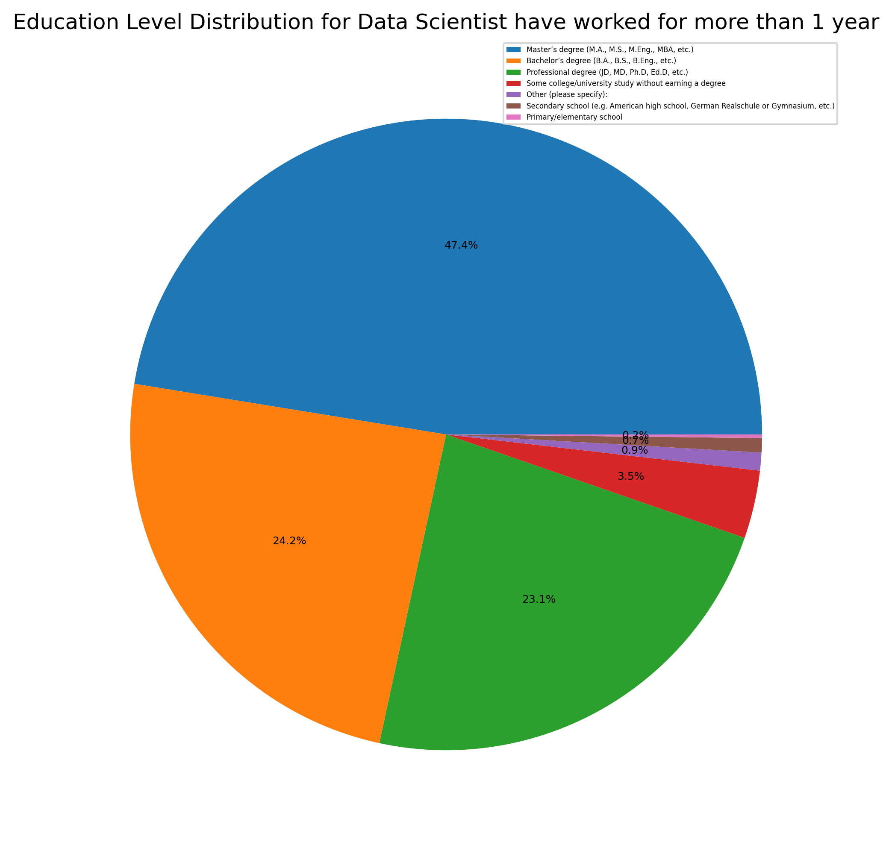

# How to Become a Data Scientist?
## Introduction
In recent years, Data Scientist has become one of the most popular and sought-after occupations worldwide. But what are the key factors for success in this career path? To explore this question, we analyzed the 2025 Stack Overflow Developer Survey, which collected about 50,000 responses.

From the dataset, we observe that only 1.17% of respondents identify as Data Scientists, highlighting that it is still a relatively small proportion compared to other developer roles. To broaden the scope, we also include AI/ML Engineers, Data Engineers, and Data/Business Analysts in the “Data Scientist” group for analysis.

## How well does data scientist pay?

The chart above shows the salary distribution in USD across different occupations. We can see that Data Scientists tend to earn slightly more than Full-Stack Developers. However, one limitation is the relatively small sample size—only around 330 Data Scientist respondents in the survey—which means results should be interpreted cautiously.

## Education level for data scientist have work more than 1 year

From the pie chart, we can see that:
* About 47% hold a Master's degree
* 24% hold a Bachelor’s degree
* 23% hold a PhD degree
* Only 6% do not have a Bachelor’s degree or higher

This suggests that having at least a Bachelor’s degree is almost essential to becoming a Data Scientist, and advanced degrees (Master’s or PhD) are quite common in the field.

## Predict salary base on work experience.
We also attempted to predict salary levels using factors such as work experience and education. Two models were trained: Random Forest and Lasso Regression. Both models highlight several key factors that significantly affect a Data Scientist’s salary:
1.  Geographic location – Working in advanced economies (e.g., the United States) is strongly associated with higher salaries.
2.	Work experience – More years of experience directly translate to higher earning potential.
3.	Education level – Higher degrees (Master’s, PhD) generally correlate with higher salaries.
4.	Technical skills – Knowledge of Snowflake, Databricks SQL, Microsoft SQL, Brew, and Bash shell also plays an important role in determining compensation.

## Conclusion

Becoming a Data Scientist requires a combination of strong academic background, relevant technical skills, and practical experience. While the job is competitive and the proportion of developers in this role is relatively small, the career prospects are promising, with higher-than-average salaries and strong demand in data-driven industries.